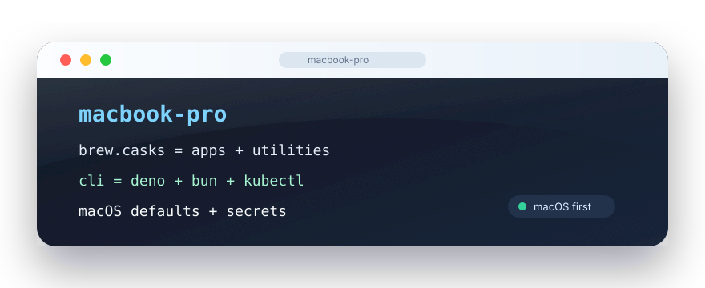

<p align="center">
  
</p>

<h1 align="center">MacBook Pro</h1>

<p align="center">
  macOS-first Nix setup. nix-darwin for the system, Home Manager for the user profile, Homebrew kept declarative.
</p>

## Use

```bash
nix fmt .
nix build '.#darwinConfigurations.macbook-pro.system'
sudo darwin-rebuild switch --flake '.#macbook-pro'
```

## What This Owns

- **Desktop layer:** Brew casks in `modules/darwin/homebrew.nix` for Raycast, Ghostty, VS Code, TablePlus, Shottr, Rectangle, Hammerspoon, Bitwarden, Wine, and Porting Kit.
- **Dev layer:** Nix owns Deno, Bun, pnpm, Go, Terraform, Kubernetes tools, Flux, Ansible, GitHub CLI, and PowerShell; Brew owns Docker, Colima, Wrangler, rustup, and nvm.
- **macOS layer:** Finder/Dock defaults, Touch ID sudo, Remote Login, Rosetta Homebrew, and Hammerspoon window snapping.
- **Work layer:** encrypted Gooskens SMB mounts, the Gooskens AD PowerShell helper, Codex defaults, and FFF MCP wiring.
- **Archive layer:** old system material is kept under `archive/nixos-reference/`; the active flake is Darwin-only.

## Shape

- `flake.nix` is the macOS entrypoint.
- `hosts/macbook-pro/` and `modules/darwin/` hold system config.
- `home/jens-darwin.nix` holds the user profile.
- `modules/home/features/` holds work-specific macOS glue.
- `modules/darwin/homebrew.nix` owns Brew taps, casks, and brews.

## Archive

Old system material lives in `archive/nixos-reference/` as reference. It is not part of the active flake.
